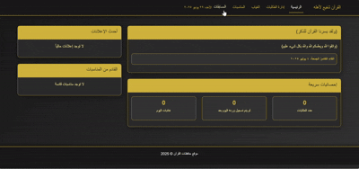

# 📖 Quran Learning System

<div align="center">
  
</div>

## 🌟 Features
- **Interactive Quran Reader**: Verse-by-verse navigation
- **Student Management**: Track learning progress
- **Search Functionality**: Find verses by keyword
- **Responsive Design**: Works on all devices
- **Audio Playback**: Listen to verse recitations

## 🛠️ Technology Stack
### Frontend


### Backend


## 🎥 System Demo
<div align="center">
  [View Full Screen Demo](view.gif)
</div>

## 📂 Project Structure
Quran-System/
├── index.html # Main application interface
├── script.js # Core functionality
├── view.gif # System demonstration
├── assets/ # Media resources
│ ├── audio/ # Verse recitations
│ └── images/ # Visual elements
└── README.md # Project documentation


## 🚀 Getting Started
1. Clone the repository:
```bash
git clone https://github.com/layanbuirat/Quran-System.git

open index.html

🌐 Live Deployment
View on GitHub Pages

📊 Technical Details
Languages: HTML (56.6%), JavaScript (43.4%)

Deployments: 5 (via GitHub Pages)

Accessibility: Screen reader compatible

<p align="center">    </p> ```
